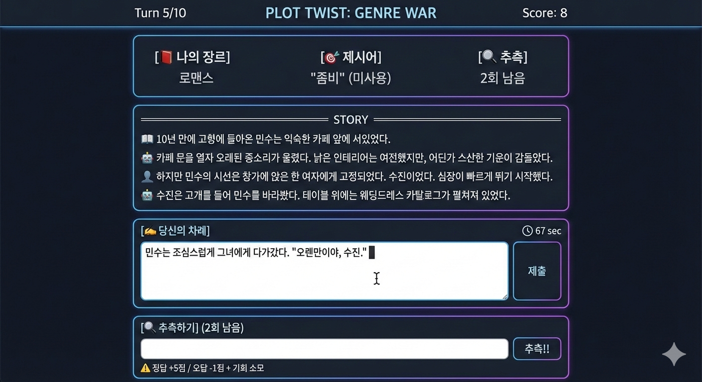

AI와 번갈아 소설을 쓰며, **장르에 안 어울리는 제시어를 자연스럽게 녹이고** 상대의 제시어를 추리하는 **창작 대결 게임**

### 1.3 핵심 재미 요소

| 요소 | 설명 |
|------|------|
|  장르 전쟁 | 서로 다른 비밀 장르로 스토리 유도 |
|  제시어 소화 | 어울리지 않는 단어를 자연스럽게 녹이기 |
|  추리 | 상대가 억지로 넣은 단어 찾기 (3회 제한) |
|  블러핑 | 미끼 단어로 상대 추측 기회 낭비시키기 (단, 난발하면 손해) |

